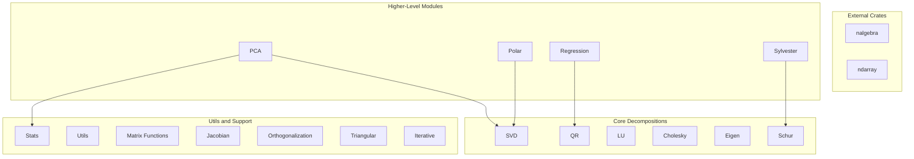

# Architecture

This is a linear algebra library written in Rust. It provides dual backends (nalgebra and ndarray) and operates solely on matrix types from those crates. Data formats (Arrow, Lance, etc.) can sit on top via separate integrations in other repositories.

## Module Dependency Diagram

## Data Flow

Matrices flow from nalgebra (`DMatrix`, `DVector`) or ndarray (`Array2`, `Array1`) into decomposition modules. Results are returned as nalgebra or ndarray types. The library does not depend on any data format; conversions happen in calling code or in separate integration crates.

## File Reference

| Module | Source File |
|--------|-------------|
| cholesky | `src/cholesky.rs` |
| eigen | `src/eigen.rs` |
| iterative | `src/iterative.rs` |
| jacobian | `src/jacobian.rs` |
| lu | `src/lu.rs` |
| matrix_functions | `src/matrix_functions.rs` |
| orthogonalization | `src/orthogonalization.rs` |
| pca | `src/pca.rs` |
| polar | `src/polar.rs` |
| qr | `src/qr.rs` |
| regression | `src/regression.rs` |
| schur | `src/schur.rs` |
| stats | `src/stats.rs` |
| svd | `src/svd.rs` |
| sylvester | `src/sylvester.rs` |
| triangular | `src/triangular.rs` |
| utils | `src/utils.rs` |
