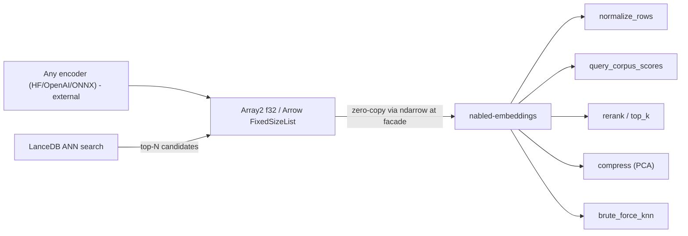

# Embeddings (`nabled-embeddings`)

A lightweight, ndarray-native, Arrow-zero-copy compute and rerank layer for embedding vectors —
bring vectors from any model, compute exactly, deploy anywhere.

`nabled-embeddings` is the exact rerank/compute step that sits **next to** a vector store, not a
vector database. It composes existing `nabled-linalg::vector` kernels and `nabled-ml::pca` into the
post-embedding numerics a retrieval pipeline needs. The facade exposes it behind the `embeddings`
feature (`nabled::embeddings::*`); `pynabled` ships it to Python as `pynabled.embeddings`.

## Scope

| Module       | Surface |
| ------------ | ------- |
| `normalize`  | `normalize_rows` / `_view` / `_into` — row-wise L2 normalization. |
| `similarity` | `query_corpus_scores` / `_view` / `_into` + the `Metric { Cosine, Dot, L2 }` enum. |
| `topk`       | `top_k(scores, k, higher_is_better) -> Vec<Neighbor<T>>` — direction-aware partial selection. |
| `rerank`     | `rerank(query, candidates, k, metric) -> Vec<Neighbor<T>>` — score + select. |
| `knn`        | `brute_force_knn(queries, corpus, k, metric)` — exact kNN for small corpora / eval / golden tests. |
| `compress`   | `fit_pca(embeddings, dims)` + `compress` / `_view` / `_into` — PCA dimensionality reduction. |

## LanceDB boundary (plug-in, not a dependency)

The supported, shipped surface is **"Arrow in → nabled compute → Arrow out."** LanceDB is one
optional *producer* of those candidate batches, never a load-bearing dependency. No
`lance`/`lancedb`/`tokio`/async appears anywhere in the crate graph; LanceDB only shows up in the
feature-gated `python/examples/embeddings/lance_rerank.py` example. This keeps default builds lean
and decouples nabled's release cadence from LanceDB's churn, and it preserves the existing facade
isolation discipline (Arrow knowledge stays at the `nabled` facade / `pynabled` boundary, never in
`nabled-core`/`linalg`/`ml`/`embeddings`).



## Model-agnostic contract (bring-your-own-vectors)

Any encoder's dense float vectors plug in unchanged (OpenAI, Cohere, Sentence-BERT, CLIP, custom)
because the crate depends only on shape and dtype (`f32`/`f64` via `NabledReal`), never the model.
Two rules the math cannot enforce, so they are documented contract:

1. Query and corpus must come from the **same model** and share the same `dim`.
2. Pick the `Metric` to match how the model was trained. `Dot` on un-normalized vectors favors
   larger-norm rows by design (the intended MIPS behavior), so choose deliberately.

## Metric selection

| Metric   | Polarity         | Delegates to                          | Use when |
| -------- | ---------------- | ------------------------------------- | -------- |
| `Cosine` | higher is better | `vector::pairwise_cosine_similarity`  | default; angle-only similarity. |
| `Dot`    | higher is better | `matrix::matmat(queries, corpusᵀ)`    | MIPS-style models; on normalized inputs this equals cosine (the normalized fast path). |
| `L2`     | lower is better  | `vector::pairwise_l2_distance`        | Euclidean models. L2 and normalized-cosine give the **same ranking**. |

`Dot` has no existing pairwise kernel (`vector::batched_dot` is row-aligned `a[i]·b[i]`, not
query × corpus), so it is implemented as `queries · corpusᵀ`. Each `Metric` records its ranking
polarity (`higher_is_better`) so the direction-aware `top_k` selection is correct for both
similarities (cosine/dot) and the L2 distance.

## Why no inference or index in core

- **No model inference / tokenizers / ONNX / candle:** encoding is the encoder's job; the crate
  starts from dense vectors. This keeps the dependency graph tiny and the crate embeddable.
- **No ANN index (HNSW/IVF) and no storage:** recall over large corpora and persistence are a
  vector store's job (e.g. LanceDB). nabled provides the **exact** rerank/normalize/compress/kNN
  compute that runs *after* ANN narrows the candidate set.

See `docs/DECISIONS.md` `D-EMB-1` / `D-EMB-2` for the locked decisions.

## Performance: benchmark before claiming

Scoring is exact and BLAS-backed, with partial-selection top-k (no full sort). This is the
defensible, lightweight, in-pipeline-efficient story — **not** a "faster than FAISS" claim. Exact
brute-force scoring is memory/BLAS-bound and competitive at parity, not dominant. Any public speed
number must come from the criterion bench (`crates/nabled-embeddings/benches/embeddings_benchmarks.rs`),
not assertion.

## Quick example (Rust)

```rust
use nabled::embeddings::{Metric, rerank};
use ndarray::arr2;

let corpus = arr2(&[[1.0_f64, 0.0], [0.0, 1.0], [0.9, 0.1]]);
let query = arr2(&[[1.0_f64, 0.0]]);
let top = rerank(&query.row(0), &corpus.view(), 2, Metric::Cosine)?;
assert_eq!(top[0].index, 0);
# Ok::<(), nabled::embeddings::EmbeddingError>(())
```

## Quick example (Python)

```python
import numpy as np
import pynabled

corpus = np.array([[1.0, 0.0], [0.0, 1.0], [0.9, 0.1]], dtype=np.float32)
query = np.array([1.0, 0.0], dtype=np.float32)
result = pynabled.embeddings.rerank(query, corpus, k=2, metric="cosine")
print(result.indices, result.scores)
```

The LanceDB ANN → exact-rerank pipeline is demonstrated end-to-end in
`python/examples/embeddings/lance_rerank.py` (requires the example-only `lance` and, optionally,
`sentence-transformers` packages).
