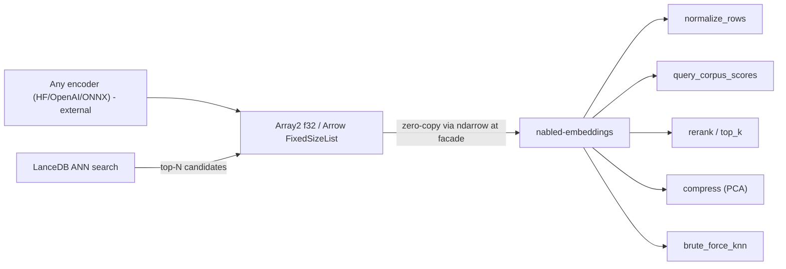

# Embeddings (`nabled-embeddings`)

A lightweight, ndarray-native, Arrow-zero-copy compute and rerank layer for embedding vectors —
bring vectors from any model, compute exactly, deploy anywhere.

`nabled-embeddings` is the exact rerank/compute step that sits **next to** a vector store, not a
vector database. It composes existing `nabled-linalg::vector` kernels and `nabled-ml::pca` into the
post-embedding numerics a retrieval pipeline needs. The facade exposes it behind the `embeddings`
feature (`nabled::embeddings::*`); `pynabled` ships it to Python as `pynabled.embeddings`.

## Scope

| Module       | Surface |
| ------------ | ------- |
| `normalize`  | `normalize_rows` / `_view` / `_into` — row-wise L2 normalization. |
| `similarity` | `query_corpus_scores` / `_view` / `_into` + the `Metric { Cosine, Dot, L2 }` enum. |
| `topk`       | `top_k(scores, k, higher_is_better) -> Vec<Neighbor<T>>` — direction-aware partial selection; `NeighborWithId<T, Id>` + `attach_ids` for id-carrying results. |
| `rerank`     | `rerank` — score + select; `rerank_with_ids` / `batch_rerank_with_ids` — id-carrying single/batch rerank. |
| `knn`        | `brute_force_knn(queries, corpus, k, metric)` — exact kNN for small corpora / eval / golden tests. |
| `cache`      | `CorpusWorkspace<T>` — build-once / query-many corpus with cached cosine norms. |
| `metrics`    | `recall_at_k`, `reciprocal_rank`, `mean_reciprocal_rank`, `ndcg_at_k` — offline ranking quality. |
| `mmr`        | `mmr(query, candidates, k, lambda, metric)` — Maximal Marginal Relevance diversification. |
| `quantize`   | `QuantizedMatrix`, `quantize_rows`, `dequantize`, `query_corpus_scores_quantized` — int8 row quantization. |
| `compress`   | `fit_pca(embeddings, dims)` + `compress` / `_view` / `_into` — PCA dimensionality reduction. |

## LanceDB boundary (plug-in, not a dependency)

The supported, shipped surface is **"Arrow in → nabled compute → Arrow out."** LanceDB is one
optional *producer* of those candidate batches, never a load-bearing dependency. No
`lance`/`lancedb`/`tokio`/async appears anywhere in the crate graph; LanceDB only shows up in the
feature-gated `python/examples/embeddings/lance_rerank.py` example. This keeps default builds lean
and decouples nabled's release cadence from LanceDB's churn, and it preserves the existing facade
isolation discipline (Arrow knowledge stays at the `nabled` facade / `pynabled` boundary, never in
`nabled-core`/`linalg`/`ml`/`embeddings`).



## Model-agnostic contract (bring-your-own-vectors)

Any encoder's dense float vectors plug in unchanged (OpenAI, Cohere, Sentence-BERT, CLIP, custom)
because the crate depends only on shape and dtype (`f32`/`f64` via `NabledReal`), never the model.
Two rules the math cannot enforce, so they are documented contract:

1. Query and corpus must come from the **same model** and share the same `dim`.
2. Pick the `Metric` to match how the model was trained. `Dot` on un-normalized vectors favors
   larger-norm rows by design (the intended MIPS behavior), so choose deliberately.

## Metric selection

| Metric   | Polarity         | Delegates to                          | Use when |
| -------- | ---------------- | ------------------------------------- | -------- |
| `Cosine` | higher is better | `vector::pairwise_cosine_similarity`  | default; angle-only similarity. |
| `Dot`    | higher is better | `matrix::matmat(queries, corpusᵀ)`    | MIPS-style models; on normalized inputs this equals cosine (the normalized fast path). |
| `L2`     | lower is better  | `vector::pairwise_l2_distance`        | Euclidean models. L2 and normalized-cosine give the **same ranking**. |

`Dot` has no existing pairwise kernel (`vector::batched_dot` is row-aligned `a[i]·b[i]`, not
query × corpus), so it is implemented as `queries · corpusᵀ`. Each `Metric` records its ranking
polarity (`higher_is_better`) so the direction-aware `top_k` selection is correct for both
similarities (cosine/dot) and the L2 distance.

## Why no inference or index in core

- **No model inference / tokenizers / ONNX / candle:** encoding is the encoder's job; the crate
  starts from dense vectors. This keeps the dependency graph tiny and the crate embeddable.
- **No ANN index (HNSW/IVF) and no storage:** recall over large corpora and persistence are a
  vector store's job (e.g. LanceDB). nabled provides the **exact** rerank/normalize/compress/kNN
  compute that runs *after* ANN narrows the candidate set.

See `docs/DECISIONS.md` `D-EMB-1` / `D-EMB-2` for the locked decisions.

## Performance: benchmark before claiming

Scoring is exact and BLAS-backed, with partial-selection top-k (no full sort). This is the
defensible, lightweight, in-pipeline-efficient story — **not** a "faster than FAISS" claim. Exact
brute-force scoring is memory/BLAS-bound and competitive at parity, not dominant. Any public speed
number must come from the criterion bench (`crates/nabled-embeddings/benches/embeddings_benchmarks.rs`),
not assertion. See `docs/BENCHMARKS.md` for the methodology, how to reproduce, and the honest
comparison framing against `numpy` cosine + argsort.

## Quick example (Rust)

```rust
use nabled::embeddings::{Metric, rerank};
use ndarray::arr2;

let corpus = arr2(&[[1.0_f64, 0.0], [0.0, 1.0], [0.9, 0.1]]);
let query = arr2(&[[1.0_f64, 0.0]]);
let top = rerank(&query.row(0), &corpus.view(), 2, Metric::Cosine)?;
assert_eq!(top[0].index, 0);
# Ok::<(), nabled::embeddings::EmbeddingError>(())
```

## Quick example (Python)

```python
import numpy as np
import pynabled

corpus = np.array([[1.0, 0.0], [0.0, 1.0], [0.9, 0.1]], dtype=np.float32)
query = np.array([1.0, 0.0], dtype=np.float32)
result = pynabled.embeddings.rerank(query, corpus, k=2, metric="cosine")
print(result.indices, result.scores)
```

## Rerank with ids (single + batch)

A recall stage usually hands back **global ids**, not the local row positions of a candidate slice.
The id-carrying rerank variants thread those ids through the exact rerank so callers never need a
separate index→id join.

- `rerank_with_ids(query, candidates, ids, k, metric) -> Vec<NeighborWithId<T, Id>>`: one stable id
  per candidate row (`ids.len() == candidates.nrows()`); each result reports the local `index`, the
  metric `score`, and the mapped `id`.
- `batch_rerank_with_ids(queries, corpus, ids, k, metric) -> Vec<Vec<NeighborWithId<T, Id>>>`: the
  batch path composes the existing `brute_force_knn` scoring (many queries vs one shared corpus)
  and then maps each corpus index to its id. There is intentionally **no bare `batch_rerank`** — it
  would duplicate `brute_force_knn`; the new value is the id mapping, not a second kNN entrypoint.

Both reject `ids` of the wrong length with `EmbeddingError::DimensionMismatch`. The low-level
helper `attach_ids(neighbors, ids, n_candidates)` and the `NeighborWithId<T, Id>` struct are public
for callers that already hold ranked `Neighbor`s. `Id` is generic in Rust (any `Copy` id);
`pynabled` accepts an int64 id array and returns `IdNeighbors(indices, ids, scores)`.

```python
result = pynabled.embeddings.rerank_with_ids(query, corpus, ids=[100, 200, 300], k=2)
print(result.indices, result.ids, result.scores)
```

## Corpus workspace reuse (build-once / query-many)

Serving evaluates many queries against the **same** corpus. The stateless `query_corpus_scores`
path recomputes the corpus's contribution (its L2 norms for cosine) on every call. `CorpusWorkspace`
precomputes that work **once** at build time and reuses it across calls, mirroring the
`PairwiseCosineWorkspace::ensure_dims` precedent in `nabled-linalg`. The workspace **owns** the
prepared corpus and the cached cosine norms; the corpus and `Metric` are fixed for its lifetime.

```rust
use nabled::embeddings::{CorpusWorkspace, Metric};
use ndarray::arr2;

let corpus = arr2(&[[1.0_f64, 0.0], [0.0, 1.0], [0.9, 0.1]]);
let ws = CorpusWorkspace::build(&corpus.view(), Metric::Cosine)?;
let query = arr2(&[[1.0_f64, 0.0]]);
let top = ws.rerank_with(&query.row(0), 2)?; // reuses cached corpus norms
# Ok::<(), nabled::embeddings::EmbeddingError>(())
```

Surface: `build`, `query_corpus_scores` / `query_corpus_scores_into` (allocation-controlled),
`rerank_with` (single query), `knn_with` (batch kNN), plus `metric` / `len` / `dim` / `is_empty`
metadata. For cosine, `nabled-linalg` has no "corpus norms already provided" entrypoint, so the
workspace scores `dot(query, corpus) / (‖query‖·‖corpus‖)` supplying the cached corpus norms; this
reproduces the stateless cosine kernel bit-for-bit (including its zero-norm rejection) while
skipping the per-call corpus-norm recompute. `Dot`/`L2` own the corpus copy and delegate to the
same kernels as the stateless path.

**Use it when** the corpus is static and you issue repeated queries against it; prefer the stateless
functions for one-shot scoring.

## Evaluation metrics (offline ranking quality)

`metrics` provides pure ranking math over **retrieved-id lists vs ground-truth-id sets** — no
embeddings or scores needed, so it is generic over any hashable id (`Id: Eq + Hash + Copy`) and
relevance is treated as **binary**. Every metric clamps internally and never panics: an empty
relevant set yields `0.0`, and `k` is clamped to the retrieved length.

| Function | Meaning |
| -------- | ------- |
| `recall_at_k(retrieved, relevant, k)` | fraction of relevant ids appearing in the first `k` retrieved. |
| `reciprocal_rank(retrieved, relevant)` | `1/rank` of the first relevant id (1-based; `0.0` if none). |
| `mean_reciprocal_rank(retrieved, relevant)` | mean of `reciprocal_rank` across parallel query lists. |
| `ndcg_at_k(retrieved, relevant, k)` | normalized discounted cumulative gain at `k`, binary relevance. |

These are offline evaluation tools (tune `k`, compare metrics/models), not part of the serving hot
path. `mean_reciprocal_rank` returns `EmbeddingError::DimensionMismatch` when its two outer lengths
differ.

## MMR (diversity-aware rerank)

Plain rerank returns the `k` most *relevant* candidates, which are often near-duplicates. `mmr`
trades a little relevance for diversity by greedily picking, at each step, the candidate maximizing

```text
lambda * relevance(query, c) - (1 - lambda) * max_{s in selected} similarity(c, s)
```

`lambda` lies in `[0, 1]`: `lambda == 1` ignores diversity and reproduces plain `rerank` order;
`lambda == 0` selects purely for novelty relative to already-picked items. Both relevance and
candidate-candidate similarity use the same `Metric`, and the rule is applied in a "higher is
better" space (L2 distances are internally negated) so it is metric-agnostic; returned
`Neighbor::score` values are the original metric scores. `lambda` outside `[0, 1]` returns
`EmbeddingError::InvalidInput`. `pynabled` exposes it as `mmr(query, candidates, k, lambda_, metric)`.

## int8 quantization (precision tradeoff)

`quantize` is an honest, minimal compression layer: it shrinks an `f32` matrix to one `i8` per
element plus one `f32` **scale per row** (per-row *symmetric* quantization: `scale = amax / 127`,
codes clamped to `[-127, 127]`, `-128` unused so there is no sign bias; a fully-zero row gets
`scale = 0` and decodes back to zeros). The win is ~4× smaller storage/transfer, traded against a
small, bounded precision loss (each value rounds to one of 255 per-row levels).

- `quantize_rows(&Array2<f32>) -> QuantizedMatrix`, `dequantize(&QuantizedMatrix) -> Array2<f32>`.
- `QuantizedMatrix::from_parts(data, scales)` to rebuild from a wire format; `data` / `scales` /
  `nrows` / `ncols` accessors.
- `query_corpus_scores_quantized(&corpus, metric)` scores by **dequantize-then-existing-kernel**:
  both operands decode to `f32` and reuse `query_corpus_scores`. There is no native int8 kernel and
  no new `nabled-linalg` surface — results approximate the full-precision path within the
  quantization tolerance, so treat it as a storage/transfer optimization, not a faster compute path.

## Arrow-native rerank wrappers

When embeddings already live in Arrow columns, the `nabled` facade exposes Arrow-native adapters
(feature `embeddings` + `arrow`, in `nabled::arrow`) that accept `FixedSizeListArray` embedding
columns zero-copy via `fixed_size_list_view`, delegate to the ndarray-native kernels, and return
Arrow-native results:

| Function | Returns |
| -------- | ------- |
| `arrow_query_corpus_scores` | `FixedSizeListArray` score matrix (one inner list per query row). |
| `arrow_rerank` | `StructArray { index: Int64, score }` of best-first neighbors. |
| `arrow_normalize_rows` | `FixedSizeListArray` of unit-L2 rows. |
| `arrow_brute_force_knn` | `ListArray` of per-query neighbor `StructArray`s. |

They are generic over `Float32Type` / `Float64Type` like the rest of `nabled::arrow`. `pynabled`
ships matching Arrow-native rerank wrappers in `pynabled.arrow` that accept and return PyArrow
arrays. The neighbor result contract is locked in `docs/DECISIONS.md` (`D-EMB-4`).

The LanceDB ANN → exact-rerank pipeline is demonstrated end-to-end in
`python/examples/embeddings/lance_rerank.py` (requires the example-only `lance` and, optionally,
`sentence-transformers` packages).
