# Architecture

This is a linear algebra library written in Rust. It provides dual backends (nalgebra and ndarray) and operates solely on matrix types from those crates. Data formats (Arrow, Lance, etc.) can sit on top via separate integrations in other repositories.

## Module Dependency Diagram

```mermaid
flowchart TB
    subgraph External [External Crates]
        nalgebra[nalgebra]
        ndarray[ndarray]
    end

    subgraph Backend [Internal Backend Kernels]
        backend_svd[SvdKernel]
        backend_qr[QrKernel]
        backend_lu[LuKernel]
        backend_cholesky[CholeskyKernel]
        backend_eigen[EigenKernel]
        backend_schur[SchurKernel]
        backend_triangular[TriangularSolveKernel]
        backend_polar[PolarKernel]
        backend_pca[PcaKernel]
        backend_regression[RegressionKernel]
        backend_sylvester[SylvesterKernel]
        backend_matrix_functions[MatrixFunctionsKernel]
    end

    subgraph Core [Core Decompositions]
        svd[SVD]
        qr[QR]
        lu[LU]
        cholesky[Cholesky]
        eigen[Eigen]
        schur[Schur]
    end

    subgraph HigherLevel [Higher-Level Modules]
        pca[PCA]
        regression[Regression]
        polar[Polar]
        sylvester[Sylvester]
    end

    subgraph Utils [Utils and Support]
        stats[Stats]
        interop[Interop]
        matrix_functions[Matrix Functions]
        jacobian[Jacobian]
        orthogonalization[Orthogonalization]
        triangular[Triangular]
        iterative[Iterative]
    end

    svd --> backend_svd
    qr --> backend_qr
    lu --> backend_lu
    cholesky --> backend_cholesky
    eigen --> backend_eigen
    schur --> backend_schur
    triangular --> backend_triangular
    polar --> backend_polar
    matrix_functions --> backend_matrix_functions
    pca --> backend_pca
    regression --> backend_regression
    sylvester --> backend_sylvester
    backend_pca --> stats
    backend_pca --> backend_svd
    backend_regression --> backend_qr
    backend_sylvester --> backend_schur
```

## Data Flow

Matrices flow from nalgebra (`DMatrix`, `DVector`) or ndarray (`Array2`, `Array1`) into decomposition modules. SVD, QR, LU, Cholesky, Eigen, Schur, triangular solve, polar decomposition, matrix functions, PCA, regression, and Sylvester/Lyapunov solve currently dispatch through internal backend kernel traits before executing backend-specific implementations. Results are returned as nalgebra or ndarray types. The library does not depend on any data format; conversions happen in calling code or in separate integration crates.

## File Reference

| Module | Source File |
|--------|-------------|
| backend (root) | `src/backend/mod.rs` |
| backend cholesky kernel | `src/backend/cholesky.rs` |
| backend eigen kernel | `src/backend/eigen.rs` |
| backend lu kernel | `src/backend/lu.rs` |
| backend matrix-functions kernel | `src/backend/matrix_functions.rs` |
| backend pca kernel | `src/backend/pca.rs` |
| backend polar kernel | `src/backend/polar.rs` |
| backend qr kernel | `src/backend/qr.rs` |
| backend regression kernel | `src/backend/regression.rs` |
| backend schur kernel | `src/backend/schur.rs` |
| backend svd kernel | `src/backend/svd.rs` |
| backend sylvester kernel | `src/backend/sylvester.rs` |
| backend triangular kernel | `src/backend/triangular.rs` |
| cholesky | `src/cholesky.rs` |
| eigen | `src/eigen.rs` |
| interop | `src/interop.rs` |
| iterative | `src/iterative.rs` |
| jacobian | `src/jacobian.rs` |
| lu | `src/lu.rs` |
| matrix_functions | `src/matrix_functions.rs` |
| orthogonalization | `src/orthogonalization.rs` |
| pca | `src/pca.rs` |
| polar | `src/polar.rs` |
| qr | `src/qr.rs` |
| regression | `src/regression.rs` |
| schur | `src/schur.rs` |
| stats | `src/stats.rs` |
| svd | `src/svd.rs` |
| sylvester | `src/sylvester.rs` |
| triangular | `src/triangular.rs` |
