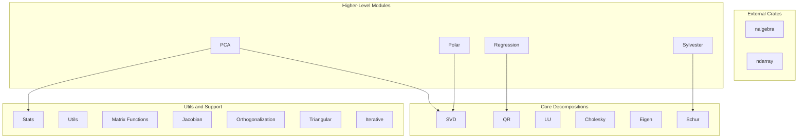

# Documentation and Markdown Updates Plan

## Summary of Current State

The codebase has grown significantly beyond what the documentation reflects. Key modules **not documented** in README/DOCUMENTATION: Cholesky, LU, Eigen, PCA, Regression, Polar, Schur, Sylvester, Orthogonalization, Stats, Iterative, Triangular. Arrow exists as an optional feature but will be removed from this repo; integrations (Arrow, Lance, etc.) will live in separate repositories.

---

## Phase 0: Remove Arrow from Repo

**Goal:** This is a linear algebra library written in Rust. Remove all Arrow code so format integrations can sit in separate repos.

### Code Changes

1. **Delete** [src/arrow/](src/arrow/) directory (mod.rs, conversions.rs, error.rs, jacobian.rs, matrix_functions.rs, qr.rs, svd.rs)
2. **Delete** [tests/arrow_integration_tests.rs](tests/arrow_integration_tests.rs)
3. **[src/lib.rs](src/lib.rs):** Remove lines 205-206: `#[cfg(feature = "arrow")] pub mod arrow;`
4. **[Cargo.toml](Cargo.toml):** Remove arrow feature (line 18), arrow/arrow-array/arrow-schema deps (29-31), and `[[test]]` for arrow_integration_tests (37-39)
5. **[.github/workflows/ci.yml](.github/workflows/ci.yml):** Remove "Clippy (with arrow)" and "Test (with arrow)" steps (lines 35-42)

### CHANGELOG (Unreleased)

- Add: "Removed Arrow integration (extracted to separate repo). This repo is a linear algebra library written in Rust."
- Remove "Optional Arrow feature" from 0.3.0 Added section (or note it was removed in a later release)

---

## Phase 1: README.md Updates

**Intro/tagline:** Add concise line: "This is a linear algebra library written in Rust." (e.g. after line 3)

**Features section (lines 5-18):** Add bullet points for:

- Cholesky Decomposition (symmetric positive-definite)
- LU Decomposition (solve Ax=b, matrix inverse)
- Eigenvalue Decomposition (symmetric matrices, generalized eigen)
- PCA (Principal Component Analysis)
- Linear Regression (OLS via QR)
- Polar Decomposition (A = UP)
- Schur Decomposition
- Sylvester Equation Solver
- Orthogonalization
- Statistical functions (covariance, correlation)

**Examples section (lines 299-315):** Add the 5 missing examples:

- `cargo run --example cholesky_example`
- `cargo run --example lu_example`
- `cargo run --example regression_example`
- `cargo run --example pca_example`
- `cargo run --example complex_jacobian_example`

**License section (line 384):** Change to "MIT or Apache-2.0, at your option" to match [Cargo.toml](Cargo.toml) line 8.

**Roadmap section (lines 388-396):** Update to reflect current state:

- Mark QR, LU, Eigenvalue as done (remove from unchecked list)
- Keep: GPU acceleration, more advanced numerical algorithms
- Consider adding: Newton's method, gradient descent, sparse matrices (from NextFunctions.md)

**API Reference:** Add brief entries for Cholesky, LU, Eigen, PCA, Regression (high-level function names only; link to full docs).

---

## 2. CHANGELOG.md Updates (Phase 1)

**Unreleased:** Add entry for Arrow removal (see Phase 0). Add placeholder for documentation updates if desired.

**0.3.0 section:** Remove "Optional Arrow feature" (now extracted). Add if missing: Polar, Schur, Sylvester, Orthogonalization, Iterative, Triangular. (Verify from git history whether these shipped in 0.3.0.)

---

## 3. DOCUMENTATION.md Updates

**Table of Contents:** Add entries for new modules (after QR): Cholesky, LU, Eigenvalue, Stats, PCA, Regression, Polar, Schur, Sylvester, Orthogonalization, Iterative, Triangular. No Arrow.

**New sections to add** (following existing format with Parameters/Returns/Example):

- **Cholesky Decomposition** - `compute_cholesky`, `solve`, `inverse` for nalgebra and ndarray
- **LU Decomposition** - `compute_lu`, `solve`, `inverse`, `log_det`
- **Eigenvalue Decomposition** - `compute_symmetric_eigen`, `compute_generalized_eigen` (nalgebra/ndarray)
- **Statistics** - `column_means`, `center_columns`, `covariance_matrix`, `correlation_matrix`
- **PCA** - `compute_pca`, `transform`, `inverse_transform`; depends on stats and SVD
- **Linear Regression** - `linear_regression` with coefficients, R-squared, residuals
- **Polar Decomposition** - `compute_polar` (A = UP via SVD)
- **Schur Decomposition** - `compute_schur` (upper quasi-triangular)
- **Sylvester Equation** - `solve_sylvester` AX + XB = C
- **Orthogonalization** - Gram-Schmidt and related functions
- **Iterative** - `IterativeConfig`, iterative solver infrastructure
- **Triangular** - triangular solve operations

**Error Handling section:** Add QRError, CholeskyError, LUError, EigenError, RegressionError, PCAError, PolarError, SchurError, SylvesterError, etc.

---

## 4. NextFunctions.md Updates

**Remove completed items** from all sections:

- QR Decomposition (entire section) - DONE
- LU Decomposition - DONE
- Cholesky Decomposition - DONE
- Eigenvalue/Eigenvector Decomposition - DONE (symmetric)
- Schur Decomposition - DONE
- Polar Decomposition - DONE
- PCA Implementation - DONE
- Least Squares Regression - DONE
- Covariance Matrix Operations - DONE (in stats)

**Update Implementation Priority Matrix (lines 158-168):** Remove completed rows; keep Newton's Method, Matrix Square Root, Gradient Descent, Levenberg-Marquardt, etc.

**Update Recommended Implementation Order (lines 172-183):** Remove items 1, 3, 5, 6, 7, 8; renumber and reprioritize remaining items.

---

## 5. Cargo.toml Updates

Arrow removal is in Phase 0. Additionally:

- **description:** Optionally expand: "A linear algebra library written in Rust. SVD, QR, LU, Cholesky, eigen, PCA, regression, matrix functions, Jacobians, and more."
- **keywords:** Verify crates.io limit (5); consider cholesky, lu, eigen, polar, schur if space allows.

---

## 6. architecture.md (New File)

Create `architecture.md` with:

1. **Overview** - This is a linear algebra library written in Rust. Dual backends: nalgebra and ndarray. Data formats (Arrow, Lance, etc.) can sit on top via separate integrations.
2. **Module dependency diagram** - Mermaid flowchart (no Arrow):

1. **Data flow** - Matrices flow from nalgebra/ndarray into decomposition modules; results returned as nalgebra/ndarray types.
2. **File reference** - Table mapping modules to source files (e.g., `svd` -> `src/svd.rs`).

---

## File Summary

| File                                                                 | Action                                                                           |
| -------------------------------------------------------------------- | -------------------------------------------------------------------------------- |
| [src/arrow/](src/arrow/)                                             | **Delete** entire directory                                                      |
| [tests/arrow_integration_tests.rs](tests/arrow_integration_tests.rs) | **Delete**                                                                       |
| [src/lib.rs](src/lib.rs)                                             | Remove arrow module (Phase 0)                                                    |
| [Cargo.toml](Cargo.toml)                                             | Remove arrow feature and deps (Phase 0); optional description/keywords (Phase 1) |
| [.github/workflows/ci.yml](.github/workflows/ci.yml)                 | Remove Arrow CI steps (Phase 0)                                                  |
| [CHANGELOG.md](CHANGELOG.md)                                         | Unreleased: Arrow removal; 0.3.0: remove Arrow, add polar/schur/sylvester/etc.   |
| [README.md](README.md)                                               | Tagline, features, examples, roadmap, license, API reference                     |
| [DOCUMENTATION.md](DOCUMENTATION.md)                                 | Add 11 new module sections, update ToC, expand error types (no Arrow)            |
| [NextFunctions.md](NextFunctions.md)                                 | Remove 9 completed items, update priority matrix and recommended order           |
| architecture.md                                                      | **Create new** - Overview, Mermaid diagram (core modules only), file reference   |

