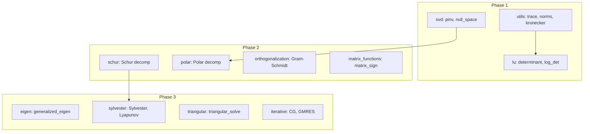

# Linear Algebra Functions Expansion Plan

## Current State

- **CI**: `cargo fmt --check` and `cargo clippy -- -D warnings` ([.github/workflows/ci.yml](.github/workflows/ci.yml))
- **Pattern**: Each module has `nalgebra_`* and `ndarray_`* submodules; nalgebra is canonical, ndarray wraps via [utils](src/utils.rs) conversions
- **Eigen**: Symmetric eigen (eigh) already exists in [src/eigen.rs](src/eigen.rs) — no change needed

---

## Phase 1: High Priority

### 1.1 Extend [src/utils.rs](src/utils.rs)

Add matrix norms and trace (dual backend: nalgebra + ndarray variants for consistency with other modules):


| Function            | Formula                | Implementation      |
| ------------------- | ---------------------- | ------------------- |
| `trace`             | sum of diagonal        | Direct loop         |
| `norm_1`            | max column sum         | Reduce over columns |
| `norm_inf`          | max row sum            | Reduce over rows    |
| `nuclear_norm`      | sum of singular values | Via existing SVD    |
| `kronecker_product` | A ⊗ B                  | Block construction  |


Pattern: Add `nalgebra_`* and `ndarray_`* submodules mirroring existing `frobenius_norm`/`spectral_norm` style. Consider refactoring existing `frobenius_norm`/`spectral_norm` into this submodule structure for consistency, or add new norms alongside.

### 1.2 Extend [src/lu.rs](src/lu.rs)

- **determinant**: `det = sign(permutation) * prod(diag(U))`. nalgebra's `LU` provides `.determinant()` — wrap with validation (empty, not square, NaN check).
- **log_determinant**: For general matrices, `log(abs(det))` + sign; for SPD use Cholesky. Add `LogDetResult { sign: i8, ln_abs_det: T }` to handle sign.

Expose `nalgebra_lu::determinant`, `nalgebra_lu::log_determinant` and ndarray equivalents.

### 1.3 Extend [src/svd.rs](src/svd.rs)

- **pseudo_inverse**: `pinv(A) = V Σ⁻¹ U^T`. Truncate tiny singular values (configurable tolerance). nalgebra SVD has `.pseudo_inverse(eps)` — we wrap with our error types.
- **null_space**: Columns of V corresponding to zero (or below-tolerance) singular values. Return `DMatrix`/`Array2` of basis vectors.

Add `PseudoInverseConfig { tolerance: Option<T> }` for pinv. Both functions work on rectangular matrices.

---

## Phase 2: Medium Priority

### 2.1 New [src/schur.rs](src/schur.rs)

Schur decomposition: A = Q T Q^H with T upper triangular. nalgebra has `matrix.schur()` / `try_schur(eps, max_iter)`.

- `SchurError`: EmptyMatrix, NotSquare, ConvergenceFailed, NumericalInstability, InvalidInput
- `SchurResult { q, t }` for nalgebra and ndarray
- Expose in lib.rs

### 2.2 New [src/polar.rs](src/polar.rs)

Polar decomposition: A = U P (orthogonal × symmetric PSD). nalgebra SVD has `to_polar()`.

- Compute SVD, then `svd.to_polar()` → `(u, p)` or derive manually: U = U_svd * V_svd^T, P = V_svd * Σ * V_svd^T
- `PolarError`, `PolarResult { u, p }`
- Square matrices only

### 2.3 New [src/orthogonalization.rs](src/orthogonalization.rs)

- **Gram-Schmidt**: Classic and modified Gram-Schmidt. Input: matrix columns; output: orthonormal basis (Q in economy QR sense).
- Implement manually (column-by-column projection).
- `OrthogonalizationError`, `OrthogonalizationResult` or just return `DMatrix`/`Array2`.

### 2.4 Extend [src/matrix_functions.rs](src/matrix_functions.rs)

- **matrix_sign**: sign(A) for diagonalizable A; via eigenvalue decomposition: sign(λ) applied to eigenvalues. Use existing `nalgebra_matrix_functions` eigen-based helpers.

---

## Phase 3: Low Priority (Specialized)

### 3.1 Extend [src/eigen.rs](src/eigen.rs)

- **Generalized eigenvalue**: Solve Av = λBv. nalgebra has `GeneralizedEigen` / `generalized_eigen` for this. Add `GeneralizedEigenError` variants; `GeneralizedEigenResult { eigenvalues, eigenvectors }`.

### 3.2 New [src/sylvester.rs](src/sylvester.rs) (or [src/matrix_equations.rs](src/matrix_equations.rs))

- **Sylvester**: AX + XB = C. Bartels-Stewart: Schur of A and B, then solve triangular system.
- **Lyapunov**: AX + XA^T = Q (special case of Sylvester).
- Depends on Schur from Phase 2.

### 3.3 Extend [src/utils.rs](src/utils.rs) or [src/lu.rs](src/lu.rs)

- **Triangular solve**: Expose `solve_lower_triangular(L, b)` and `solve_upper_triangular(U, b)`. nalgebra provides these on triangular views. New `triangular.rs` module or add to `lu`/`cholesky`.

### 3.4 New [src/iterative.rs](src/iterative.rs)

- **Conjugate Gradient (CG)**: For SPD systems Ax = b.
- **GMRES**: For general nonsingular Ax = b.

Implement from scratch or use nalgebra linalg if available. Requires convergence tolerance, max iterations. Largest effort; consider optional feature flag `iterative` if we add external deps.

---

## Module Registration

Update [src/lib.rs](src/lib.rs):

```rust
pub mod polar;
pub mod schur;
pub mod orthogonalization;
pub mod sylvester;      // or matrix_equations
pub mod triangular;    // if separate
pub mod iterative;     // possibly feature-gated
```

Re-export new error and result types.

---

## Implementation Order and Dependencies




---

## Code Quality and Consistency

1. **Clippy**: All new code must pass `cargo clippy -- -D warnings`. Address any new lints (e.g. `must_use`, `unwrap_or_else`, etc.).
2. **Format**: Run `cargo fmt` on all touched files.
3. **Errors**: Follow existing pattern: `#[derive(Debug, Clone, PartialEq)] pub enum XxxError`, `impl Display`, `impl Error`.
4. **Tests**: Each new function gets unit tests in the module's `#[cfg(test)] mod tests` and/or integration tests in [tests/integration_tests.rs](tests/integration_tests.rs).
5. **Docs**: Module-level `//!` docstrings and `///` on public items; include small usage examples where helpful.

---

## Suggested Execution Order

1. **Phase 1** (utils → lu → svd) — quick wins, no new modules
2. **Phase 2** (schur → polar → orthogonalization → matrix_sign)
3. **Phase 3** (triangular → sylvester → generalized eigen → iterative last)

