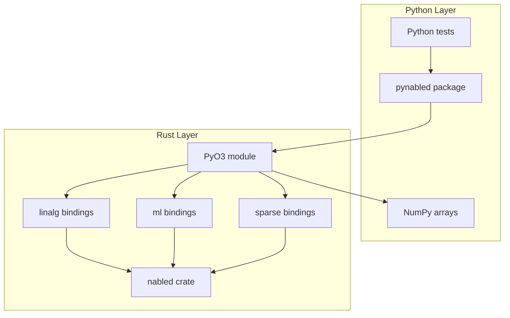

# pynabled: Full Python Bindings for nabled

## Scope

Expose the complete nabled API to Python via PyO3, using the crate name `pynabled` and package name `pynabled`. All functions accept and return NumPy arrays (`numpy.ndarray`). Sparse matrices use CSR format (indptr, indices, data) compatible with scipy.sparse.csr_matrix.

---

## Architecture




---

## 1. Workspace and Crate Setup

**Workspace change** ([Cargo.toml](Cargo.toml)): Add `crates/pynabled` to `members`.

**New crate** `crates/pynabled/`:

- `Cargo.toml`: cdylib, deps: `nabled`, `nabled-linalg`, `nabled-ml`, `numpy`, `pyo3`
- `[lib] name = "pynabled"` (Python import: `import pynabled`)
- Features: `openblas-system`, `accelerator-rayon` (optional, passthrough to nabled)

**Root** `pyproject.toml` for maturin:

- `[project] name = "pynabled"`
- `[tool.maturin] manifest-path, python-source = "python"`

---

## 2. Module Structure

Organize bindings into Rust submodules to keep `lib.rs` manageable:

```
crates/pynabled/src/
  lib.rs           # PyModule registration, error mapping
  error.rs         # E: Display -> PyErr conversion
  linalg/
    mod.rs
    svd.rs
    qr.rs
    lu.rs
    cholesky.rs
    eigen.rs
    schur.rs
    polar.rs
    sylvester.rs
    triangular.rs
    matrix_functions.rs
    orthogonalization.rs
    matrix.rs
    vector.rs
    tensor.rs
    batched.rs
  sparse/
    mod.rs
    csr.rs         # CsrMatrix from (indptr, indices, data)
    solvers.rs     # jacobi, gauss_seidel, pcg, gmres_*, bicgstab_*
    preconditioners.rs
  ml/
    mod.rs
    regression.rs
    pca.rs
    stats.rs
    iterative.rs   # CG, GMRES (dense)
    optimization.rs
    jacobian.rs
```

---

## 3. Domain Coverage (Full Suite)

### 3.1 Decompositions (linalg)


| Domain         | Functions to Expose                                                                                                                               |
| -------------- | ------------------------------------------------------------------------------------------------------------------------------------------------- |
| **svd**        | `decompose`, `decompose_truncated`, `decompose_complex`, `pseudo_inverse`, `reconstruct_matrix`, `condition_number`, `rank`, `null_space`         |
| **qr**         | `decompose`, `decompose_reduced`, `decompose_with_pivoting`, `decompose_complex`, `solve_least_squares`, `reconstruct_matrix`, `condition_number` |
| **lu**         | `decompose`, `solve`, `solve_complex`, `inverse`, `inverse_complex`, `determinant`, `determinant_complex`, `log_determinant`                      |
| **cholesky**   | `decompose`, `decompose_complex`, `solve`, `solve_complex`, `inverse`, `inverse_complex`                                                          |
| **eigen**      | `symmetric`, `generalized`, `nonsymmetric`, `nonsymmetric_complex`, `nonsymmetric_bi`, `balance_nonsymmetric`                                     |
| **schur**      | `compute_schur`, `compute_schur_complex`                                                                                                          |
| **polar**      | `compute_polar`, `compute_polar_complex`                                                                                                          |
| **sylvester**  | `solve_sylvester`, `solve_sylvester_complex`, `solve_lyapunov`, `solve_lyapunov_complex`                                                          |
| **triangular** | `solve_lower`, `solve_upper`, `solve_lower_matrix`, `solve_upper_matrix` (+ complex)                                                              |


### 3.2 Matrix Primitives (linalg)


| Domain                | Functions                                                                                                                                                                                     |
| --------------------- | --------------------------------------------------------------------------------------------------------------------------------------------------------------------------------------------- |
| **matrix**            | `matvec`, `matmat`, `batched_row_matvec`, `batched_matmat`, `batched_matmat_broadcast_left`, `batched_matmat_broadcast_right` (+ complex)                                                     |
| **vector**            | `dot`, `dot_hermitian`, `l2_norm`, `l2_norm_complex`, `cosine_similarity`, `cosine_distance`, `pairwise_l2_distance`, `pairwise_cosine_similarity`, `pairwise_cosine_distance`, `batched_dot` |
| **matrix_functions**  | `matrix_exp`, `matrix_exp_eigen`, `matrix_log_taylor`, `matrix_log_eigen`, `matrix_log_svd`, `matrix_power`, `matrix_sign` (+ complex)                                                        |
| **orthogonalization** | `gram_schmidt`, `gram_schmidt_classic` (+ complex)                                                                                                                                            |


### 3.3 Tensor (linalg)


| Functions                                                                                                                                                                                                                            |
| ------------------------------------------------------------------------------------------------------------------------------------------------------------------------------------------------------------------------------------ |
| `cube_matvec`, `cube_matmat`, `sum_last_axis`, `l2_norm_last_axis`, `normalize_last_axis`, `batched_dot_last_axis`, `permute_axes`, `contract_axes`, `batched_matmul_last_two`, `einsum`, `hosvd3`, `hosvd3_reconstruct` (+ complex) |


### 3.4 Batched (linalg)


| Functions                                        |
| ------------------------------------------------ |
| `qr`, `svd`, `lu`, `cholesky`, `symmetric_eigen` |


### 3.5 Sparse (linalg)

**CSR construction**: Accept `(nrows, ncols, indptr, indices, data)` from Python (scipy.sparse.csr_matrix compatible).


| Category            | Functions                                                                                                                                                                                                                                                                                                                              |
| ------------------- | -------------------------------------------------------------------------------------------------------------------------------------------------------------------------------------------------------------------------------------------------------------------------------------------------------------------------------------- |
| **Core**            | `matvec`, `matmat_dense`, `matmat_sparse`, `batched_matvec`, `transpose`, `csr_to_csc`                                                                                                                                                                                                                                                 |
| **Preconditioners** | `jacobi_preconditioner`, `apply_jacobi_preconditioner`, `ilu0_factor`, `apply_ilu0_preconditioner`, `ilut_factor`, `apply_ilut_preconditioner`, `iluk_factor`, `apply_iluk_preconditioner`, `ic0_factor`, `apply_ic0_preconditioner`, `ildl0_factor`, `apply_ildl0_preconditioner`                                                     |
| **Direct**          | `sparse_lu_factor`, `sparse_lu_solve`, `sparse_lu_solve_with_factorization`, `sparse_lu_solve_multiple_with_factorization`                                                                                                                                                                                                             |
| **Iterative**       | `jacobi_solve`, `gauss_seidel_solve`, `pcg_solve`, `pcg_ic0_solve`, `gmres_ilu0_solve`, `gmres_ilut_solve`, `gmres_iluk_solve`, `gmres_ildl0_solve`, `bicgstab_solve`, `bicgstab_ilu0_solve`, `bicgstab_ilut_solve`, `bicgstab_iluk_solve`, `bicgstab_ildl0_solve` (+ `_with_factorization`, `_with_config` variants where applicable) |


### 3.6 ML (nabled-ml)


| Domain           | Functions                                                                                                                                                                  |
| ---------------- | -------------------------------------------------------------------------------------------------------------------------------------------------------------------------- |
| **regression**   | `linear_regression`, `linear_regression_complex`                                                                                                                           |
| **pca**          | `compute_pca`, `compute_pca_complex`, `transform`, `inverse_transform` (+ complex)                                                                                         |
| **stats**        | `column_means`, `center_columns`, `covariance_matrix`, `correlation_matrix` (+ complex)                                                                                    |
| **iterative**    | `conjugate_gradient`, `gmres`, `conjugate_gradient_complex`, `gmres_complex`                                                                                               |
| **optimization** | `gradient_descent`, `adam`, `momentum_descent`, `rmsprop`, `projected_gradient_descent_box`, `stochastic_gradient_descent`, `bfgs`, `backtracking_line_search` (+ complex) |
| **jacobian**     | `numerical_jacobian`, `numerical_jacobian_central`, `numerical_gradient`, `numerical_hessian`                                                                              |


**Optimization/Jacobian note**: These accept Rust closures `F: Fn(&Array1<T>) -> T`. Python cannot pass closures into Rust directly. Options: (a) defer optimization/jacobian to a later phase with a callback registration mechanism, or (b) expose a minimal subset that takes precomputed gradient arrays. Plan: **defer** optimization and jacobian to Phase 2; document as future work.

---

## 4. NumPy Conversion Pattern

All bindings use a consistent pattern:

```rust
// Input: PyArray2<f64> -> ndarray::Array2<f64>
let arr = a.readonly();
let view = arr.as_array();
// Use view.to_owned() if API requires owned, or pass view for view-accepting APIs

// Output: ndarray -> PyArray
Ok(PyArray2::from_owned_array(py, result))
```

- Require C-contiguous (row-major) NumPy arrays; document in Python docstrings.
- Use `numpy::PyArray1`, `PyArray2`, `PyArray3`, `PyArrayD` as appropriate.
- For `ArrayD`, use `PyArrayD` and `numpy::ndarray::IntoPyArray` or equivalent.

---

## 5. Sparse CSR Format

Python side: accept `(nrows, ncols, indptr, indices, data)` where:

- `indptr`: 1D int64 array, length `nrows + 1`
- `indices`: 1D int64 array, column indices
- `data`: 1D float64 array, values

Rust: build `CsrMatrix { nrows, ncols, indptr: Vec<usize>, indices: Vec<usize>, data: Vec<f64> }` from these. Validate with `CsrMatrix::new()` or equivalent constructor.

---

## 6. Error Handling

Central `to_py_err<E: Display>(err: E) -> PyErr` mapping all nabled errors to `PyValueError` (or a custom `NabledError` Python exception if preferred). Map domain errors (`SVDError`, `CholeskyError`, etc.) via their `Display` impl.

---

## 7. Python Package Layout

```
python/
  pynabled/
    __init__.py      # Re-exports from _pynabled
  tests/
    test_svd.py
    test_qr.py
    test_lu.py
    test_cholesky.py
    test_eigen.py
    test_matrix.py
    test_vector.py
    test_regression.py
    test_pca.py
    test_sparse.py
    ... (one per domain or logical group)
```

`__init__.py` re-exports all public functions from the extension module `_pynabled`.

---

## 8. Implementation Phases


| Phase       | Scope                                                                                                      | Est. bindings |
| ----------- | ---------------------------------------------------------------------------------------------------------- | ------------- |
| **Phase 1** | Crate setup, error mapping, decompositions (svd, qr, lu, cholesky), matrix, vector, regression, pca, stats | ~50           |
| **Phase 2** | eigen, schur, polar, sylvester, triangular, matrix_functions, orthogonalization, batched                   | ~60           |
| **Phase 3** | tensor (cube + ArrayD ops)                                                                                 | ~25           |
| **Phase 4** | sparse (CSR construction + all solvers/preconditioners)                                                    | ~50           |
| **Phase 5** | iterative (CG, GMRES dense), complex variants where missing                                                | ~15           |


---

## 9. Build and Test

```bash
pip install maturin numpy
maturin develop -p pynabled
pytest python/tests/
```

CI: Add a job that runs `maturin build -p pynabled` and `pytest python/tests/` (requires Python + numpy in CI).

---

## 10. Documentation Updates

- [docs/DECISIONS.md](docs/DECISIONS.md): Update "Python bindings" from deferred to implemented; reference `pynabled`.
- [docs/STATUS.md](docs/STATUS.md): Add pynabled to status snapshot.
- [README.md](README.md): Add "Python" section with install/usage for `pynabled`.

---

## Key Files to Create/Modify


| File                              | Action                                     |
| --------------------------------- | ------------------------------------------ |
| [Cargo.toml](Cargo.toml)          | Add `crates/pynabled` to members           |
| `crates/pynabled/Cargo.toml`      | Create (cdylib, deps)                      |
| `crates/pynabled/src/lib.rs`      | Create (PyModule, submodule registration)  |
| `crates/pynabled/src/error.rs`    | Create (to_py_err)                         |
| `crates/pynabled/src/linalg/*.rs` | Create (per-domain bindings)               |
| `crates/pynabled/src/sparse/*.rs` | Create (CSR + solvers)                     |
| `crates/pynabled/src/ml/*.rs`     | Create (regression, pca, stats, iterative) |
| `pyproject.toml`                  | Create (maturin config)                    |
| `python/pynabled/__init__.py`     | Create                                     |
| `python/tests/*.py`               | Create (test stubs, user fills use-cases)  |


